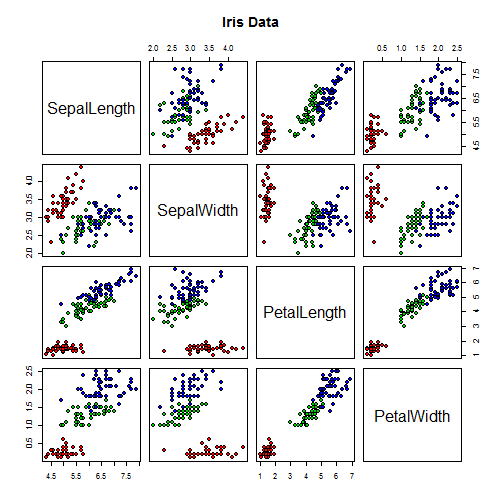

## Interactive application of Predicting Iris species

1. Used to classify one of three Iris plant species setosa, virginica, versiflower.
2. Based on flower sepal and petal measurements in centimeters
3. Provides a choice of two classification models.
4. Models were trained against Ronald Fisher's <a href="https://en.wikipedia.org/wiki/Iris_flower_data_set">iris flower dataset</a> available in base R.
5. User enters 4 measurements and receives a prediction.

<br>
<br>

The two classification models are based on the following algorithms

1. <b> randomForest </b> which is a tree based predictor based on bootstrapped aggregation.
2. <b> rpart </b> Regression Partitioning and Decision Tree


Description for using these two algorithms with R are available <a href="http://www.statmethods.net/advstats/cart.html">here.</a>


--- .class #id 

## Descriptive statistics : Iris Data Set 


```
##   Sepal.Length Sepal.Width Petal.Length Petal.Width Species
## 1          5.1         3.5          1.4         0.2  setosa
```

```
##   Sepal.Length    Sepal.Width     Petal.Length    Petal.Width   
##  Min.   :4.300   Min.   :2.000   Min.   :1.000   Min.   :0.100  
##  1st Qu.:5.100   1st Qu.:2.800   1st Qu.:1.600   1st Qu.:0.300  
##  Median :5.800   Median :3.000   Median :4.350   Median :1.300  
##  Mean   :5.843   Mean   :3.057   Mean   :3.758   Mean   :1.199  
##  3rd Qu.:6.400   3rd Qu.:3.300   3rd Qu.:5.100   3rd Qu.:1.800  
##  Max.   :7.900   Max.   :4.400   Max.   :6.900   Max.   :2.500  
##        Species  
##  setosa    :50  
##  versicolor:50  
##  virginica :50  
##                 
##                 
## 
```

--- .class #id 

## Pairs Plot : Iris Data Set 
 

--- .class #id 

## Usage

1. The application is available <a href="https://subrotod.shinyapps.io/DDProject">here.</a>
2. The data is entered in <b>cms </b> in the left panel.
3. <b>Important </b> Press the Go! button to obtain the predictions on the input data.
4. The prediction is available in the Result panel. The two algorithms may give different predictions in some cases.
5. Refer to the Help panel for sample data.


